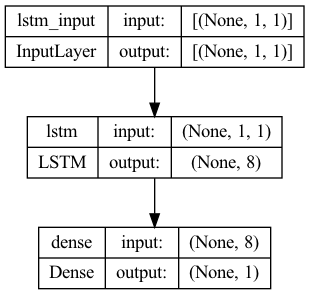

#  Deep Learning Model to Predict COVID-19 Vaccinations in Massachusetts

---

## Overview
- [Technologies Used](#Technology-&-Methods)
- [Executive Summary](#Executive-Summary)
- [Introduction](#Introduction)
  - [Problem Statement](#Problem-Statement)
  - [Industry Relevance](#Industry-Relevance)
- [Data](#Data)
  - [Data Source](#Data-Source)
  - [Data Dictionary](#Data-Dictionary)
  - [Data Cleaning](#Data-Cleaning)
- [Modeling](#Modeling)
  - [Pre-processing](#Pre-processing)
  - [Models](#Model-Evaluation)
- [Conclusion](#Conclusion)
  - [Results](#Results)
  - [Next Steps](#Next-Steps)
- [Citations](#Citations)

---

## Technology & Methods

**Technology:** Python, Jupyter Notebook, GitHub, Git, pandas, numpy, matplotlib, seaborn, scikit-learn, statsmodels, math, time, OS, random, Tensorflow, Keras, Tableau, Pickle, Joblib

**Models:** Persistence time-series, LSTM RNN

**Skills:** Gridsearching, Cross Validation, Train-Test-Spliting, MinMaxScaler, Data Imputation, Time Series Data Preparation, Neural Networks, Deep Learning, Time Series Forecasting, Pickling

## Executive Summary

In this project, I sought to forecast 7 days worth of total COVID-19 vaccinations in Massachusetts with a lower RMSE and MAPE than a persistence model baseline (12900 and 0.13%, respectively). I accomplished this goal by using GridSearchCV to tune an LSTM RNN trained on 227 days worth of data which yielded an RMSE of 4918 and MAPE of 0.04% for single-step forecasting, and an RMSE of 13999 and MAPE of 0.12% for recursive multi-step forecasting.

---

## Introduction
### Problem Statement

COVID-19 is an emergent disease that forced societies all over the world to shut down, in virtually every context1. With the creation of vaccines to combat the virus, we've moved into the next stage where societies will be allowed to reopen. The ability to predict the progress of COVID-19 vaccination campaigns is crucial to governments in order to inform decision making regarding policy that aims to reopen society. 

The goals for this project was divided in two parts: 
(1) Utilize recurrent neural networks to build various time series forecasting models that predict the total number of vaccines that will be administered each day over a 7-day time period in Massachusetts, USA. Models will be evaluated using RMSE and MAPE, with the best model being used for part two. 
(2) Develop a pipeline to extract, transform, and load raw vaccination data into the production model, and to then visualize the predictions in a streamlit application that updates weekly. 

### Industry Relevance

The global spread of COVID-19 is increasing day by day, creating a larger risk of disease or death as well as a strain on the economy1. As of April 18, 2021, there have been 31.7 million cases of COVID-19 in the united states, and 567,000 deaths1.

As of April 18, 2021, three vaccines had received emergency authorization from the FDA to be used at a population wide level to prevent the contraction and spread of COVID-19 (although the Johnson & Johnson vaccine has been halted in order to investigate severe adverse outcomes)2, and 25% of US adults are fully vaccinated. This is significant because the key to returning back to “normal” life is ensuring that the vast majority of the population is vaccinated and has resistance to the virus2. 

As of April 18, 2021, about 30% of US adults in Massachussetts are fully vaccinated3. The state of Massachusetts is in Phase 4 of their reopening plan, which was reached once there was a vaccine for COVID-19. Although this stage is called the "new normal", there are still a multitude of restrictions on businesses and individuals in the state that prevent life from feeling normal, and there has been little guidance from the state as to when they believe industries will reopen. The better the state of Massachusetts is able to forecast vaccinations, the better they will be able to inform businesses and individuals when the state will continue to reopen.

## Data
### Data Source
Data was taken from the "Our World in Data" (OWID) repository in GitHub. OWID pulls data from the CDC and from Johns Hopkins University.
- https://github.com/owid/covid-19-data

### Data Dictionary

|Feature|Type|Description|
|---|---|---|
|**date**|datetime|date of the observation|
|**total_vaccinations**|float|total number of doses administered. This is counted as a single dose, and may not equal the total number of people vaccinated, depending on the specific dose regime (e.g. people receive multiple doses). If a person receives one dose of the vaccine, this metric goes up by 1. If they receive a second dose, it goes up by 1 again|
|**total_vaccinations_per_hundred**|float|total_vaccinations per 100 people in the total population of the state|
|**daily_vaccinations_raw**|float|daily change in the total number of doses administered. It is only calculated for consecutive days. This is a raw measure provided for data checks and transparency, but we strongly recommend that any analysis on daily vaccination rates be conducted using daily_vaccinations instead|
|**daily_vaccinations**|float|new doses administered per day (7-day smoothed). For countries that don't report data on a daily basis, we assume that doses changed equally on a daily basis over any periods in which no data was reported. This produces a complete series of daily figures, which is then averaged over a rolling 7-day window|
|**daily_vaccinations_per_million**|float|daily_vaccinations per 1,000,000 people in the total population of the state|
|**people_vaccinated**|float|total number of people who received at least one vaccine dose. If a person receives the first dose of a 2-dose vaccine, this metric goes up by 1. If they receive the second dose, the metric stays the same|
|**people_vaccinated_per_hundred**|float|people_vaccinated per 100 people in the total population of the state|
|**people_fully_vaccinated**|float|total number of people who received all doses prescribed by the vaccination protocol. If a person receives the first dose of a 2-dose vaccine, this metric stays the same. If they receive the second dose, the metric goes up by 1|
|**people_fully_vaccinated_per_hundred**|float|people_fully_vaccinated per 100 people in the total population of the state|
|**total_distributed**|float|cumulative counts of COVID-19 vaccine doses recorded as shipped in CDC's Vaccine Tracking System|
|**total_distributed_per_hundred**|float|cumulative counts of COVID-19 vaccine doses recorded as shipped in CDC's Vaccine Tracking System per 100 people in the total population of the state|
|**share_doses_used**|float|share of vaccination doses administered among those recorded as shipped in CDC's Vaccine Tracking System|

### Data Cleaning
A Massachusetts COVID-19 specific dataset was created out of the raw dataset. Missing data was imputed using linear interpolation.

---

## Modeling
### Pre-processing
The "total vaccinations" feature was checked for autocorrelation, partial autocorrelation, trend, seasonality, and stationarity using an augmented dickey-fuller test.

Data was scaled using a MinMaxScaler with range [0,1]. Data was split into train and test groups with each X value equaling T-1 and each corresponding y value equaling time T that we are trying to predict. Data was converted from a 2-dimensional to 3-dimensional shape in order to satisfy the LSTM requirements. GridSearchCV was performed in order to tune hyperparameters.

### Model Evaluation

Three GridSearchCV models were created, and the parameters GridSearched as well as their best parameters are presented below:

| Params GridSearched             | Best Params               |
|---------------------------------|---------------------------|
| Neurons, Epochs, Learning Rate (Lr)  | Neurons: 8, Epochs: 50, Lr: 0.0005   |
| Neurons, Dropout, Batch Size    | Neurons: 32, Dropout: 0.8, Batch Size: 1      |
| Neurons, Dropout, Learning Rate (Lr) | Neurons: 128, Dropout: 0.8, Lr: 0.001 |          |

Three LSTM RNN models were created based off of the best parameters from the GridSearch. They were fit on 227 days worth of data with MSE used as the loss function, and their RMSE and MAPE for one-step forecasting for the seven-days of test data are presented below:

| Model   | RMSE      | MAPE  |
|---------|-----------|-------|
| Model 1 | 4917.93   | 0.04% |
| Model 2 | 105338.02 | 1.11% |
| Model 3 | 138232.56 | 1.46% |

The RMSE and MAPE for recursive multi-step forecasting for seven-days are presented below:

| Model   | RMSE      | MAPE  |
|---------|-----------|-------|
| Model 1 | 13999.36  | 0.12% |
| Model 2 | 458262.63 | 4.32% |
| Model 3 | 532559.40 | 5.09% |

Although seeds were initially set and reset in order to preserve reproducibility, repeat experiments will yield a distribution of different results due to the randomness of the initial weights when running keras models. Model 1 was ran 30 times in order to get a distribution of RMSE scores for recursive multi-step forecasting. The distribution is presented below:

|      | RMSE     |
|------|----------|
| mean | 15788.54 |
| std  | 2718.52  |
| min  | 8366.28  |
| 25%  | 14140.93 |
| 50%  | 15711.51 |
| 75%  | 18011.43 |
| max  | 20011.66 |

---

## Conclusion
### Results
My baseline model had an RMSE of 12900 and and MAPE of 0.13%. Model 1, which was the simplest model, yielded the lowest RMSE scores and lowest MAPE scores. I believe this is due to the relatively low amount of data, and by keeping the amount of neurons low and by keeping the model simple, it was able to forecast total vaccinations better than models 2 and 3.

**Model 1 Architecture:** 

By running the model 30 times, it is evident that the recursive multi-step forecasting median RMSE of 15711.51 is only marginally higher than the single-step baseline RMSE, with the minimum RMSE of 8366.28 being significantly lower. This shows that LSTM RNNs can be a viable technique in predicting COVID-19 total vaccinations in the state of Massachusetts.

### Next Steps
Data was not differenced since the augmented Dickey-Fuller test on undifferenced data showed stationarity, but differenced data could be used to yield better results. More features, as well as using timesteps greater than 1 can be used to train the model on larger dimensioned X-values that may more accurately forecast their corresponding time points (y-values).

As more data is inherently made available due to the continuation of the pandemic, it can provide the model with more data to train on and to create more accurate forecasts. A streamlit application that auto updates weekly will be one way to utilize the increase in data and to see if the forecasts improve over time.

---

## Citations
1: https://covid.cdc.gov/covid-data-tracker/#datatracker-home
 
2: https://www.fda.gov/vaccines-blood-biologics/vaccines/emergency-use-authorization-vaccines-explained
 
3: https://www.mass.gov/info-details/reopening-massachusetts
